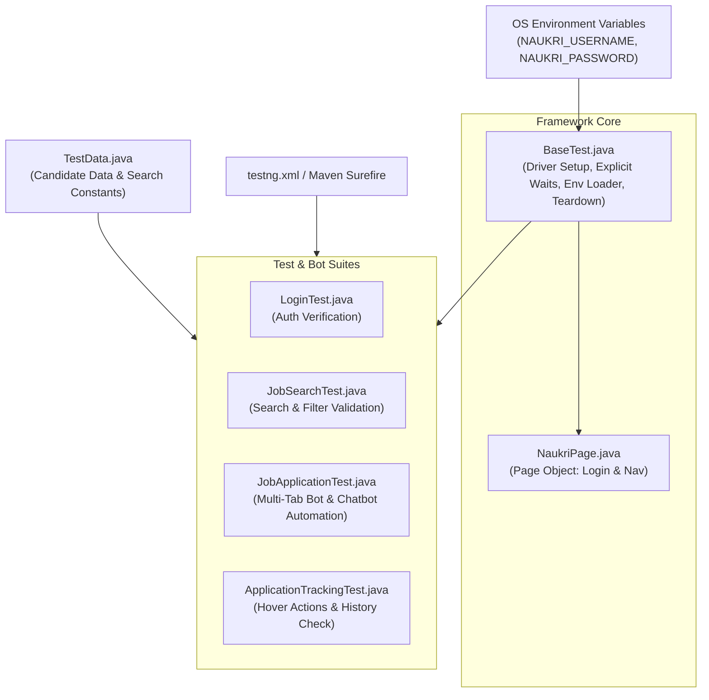

# 🚀 Naukri Portal Automation & Job Application Bot

[](https://www.oracle.com/java/)
[](https://www.selenium.dev/)
[](https://testng.org/)
[](https://maven.apache.org/)

An enterprise-grade test automation and intelligent job application framework for **[Naukri.com](https://www.naukri.com)** built with **Java**, **Selenium WebDriver 4**, **TestNG**, and **Maven**.

This project serves two primary purposes:
1. **End-to-End Regression Suite:** Automated validation of critical portal workflows including user authentication, keyword/location job search, dynamic filter verification, and application history tracking.
2. **Intelligent Job Application Bot:** An automated engine that searches for specific job profiles (e.g., *QA Automation Engineer*), opens listings across isolated browser tabs, filters direct applications from external company redirects, interacts with Naukri's conversational recruiter screening chatbot, answers screening questions from a candidate profile repository, and tracks successful submissions up to a configured threshold.

---

## 📑 Table of Contents
- [Architecture & Design Patterns](#-architecture--design-patterns)
- [Key Features](#-key-features)
- [Project Directory Structure](#-project-directory-structure)
- [Tech Stack](#-tech-stack)
- [Prerequisites](#-prerequisites)
- [Configuration & Environment Variables](#-configuration--environment-variables)
- [Candidate Profile Configuration](#-candidate-profile-configuration)
- [Executing Tests & The Bot](#-executing-tests--the-bot)
- [Test Reports](#-test-reports)
- [Safety Guardrails & Resilience](#-safety-guardrails--resilience)
- [Disclaimer](#-disclaimer)

---

## 🏛 Architecture & Design Patterns

The framework is architected following industry-standard automation principles:

- **Page Object Model (POM):** Decouples UI element locators and low-level page interactions ([`NaukriPage.java`](src/test/java/pages/NaukriPage.java)) from test assertion logic.
- **Abstract Base Test Pattern:** Centralizes WebDriver initialization, explicit synchronization rules, tear-down routines, and secure credential handling in an abstract base class ([`BaseTest.java`](src/test/java/utils/BaseTest.java)).
- **Utility Class Pattern:** Encapsulates search constants and candidate profile data in a `final` class with a private constructor ([`TestData.java`](src/test/java/utils/TestData.java)).
- **Zero-Credential Codebase (12-Factor App):** Sensitive authentication credentials (`NAUKRI_USERNAME`, `NAUKRI_PASSWORD`) are loaded strictly from the operating system's environment table at runtime via `System.getenv()`, preventing credential leaks in Git history.
- **Fail-Fast Assertion Validation:** Immediate pre-flight assertions ensure environment variables are populated before launching the browser.



---

## ✨ Key Features

### 1. Robust Authentication Testing ([`LoginTest.java`](src/test/java/tests/LoginTest.java))
- **Valid Login:** Verifies successful login using dynamic compound conditions (`ExpectedConditions.or(...)`) checking for either the landing page profile header or the `"homepage"` URL segment.
- **Invalid Login:** Tests wrong-password scenarios and verifies that portal error messages (`.commonErrorMsg`) are properly rendered.

### 2. Advanced Search & Filter Validation ([`JobSearchTest.java`](src/test/java/tests/JobSearchTest.java))
- Expands dynamic search bars, inputs designations and locations, and submits queries.
- Asserts URL rewrites (e.g., `qa-automation-engineer-jobs-in-pune`), page title matching, body text content, and verifies that matching job cards appear.

### 3. Multi-Tab Job Application Engine ([`JobApplicationTest.java`](src/test/java/tests/JobApplicationTest.java))
- **Selenium 4 Tab Orchestration:** Uses `driver.switchTo().newWindow(WindowType.TAB)` to inspect job listings in new tabs while preserving the main search results state.
- **Smart Route Detection:** Distinguishes between internal **Naukri Apply** and external **Company Site** redirects, skipping external redirects automatically.
- **Conversational Chatbot Automation:**
  - Detects and waits for the Naukri recruiter chatbot drawer (`div.chatbot_DrawerContentWrapper`).
  - Reads recruiter screening questions from dynamic message bubbles.
  - Interacts with rich text editors (`div.textArea[contenteditable='true']`) using JavaScript scrolling and input commands.
  - Automatically matches questions against candidate metrics (years of experience in Selenium, Appium, Java, Python, API testing, Notice Period, Current/Expected CTC, relocation willingness, night shifts, and education).
- **Safety Threshold & Guardrail:**
  - **No Guessing Guardrail:** If an unknown recruiter question is encountered, the bot stops the application for that listing and closes the tab to avoid submitting incorrect candidate data.
  - Caps applications to a configurable batch size (`MAX_APPLICATIONS = 5`).

### 4. Application History Navigation ([`ApplicationTrackingTest.java`](src/test/java/tests/ApplicationTrackingTest.java))
- Uses Selenium's `Actions` API to hover over the top navigation menu (`Recommended Jobs`), locates hidden dropdown links, and validates navigation to `/myapply/historypage`.

### 5. Resilient Dynamic DOM Handling
- Includes a custom retry mechanism (`clickWhenReady`, `openJobSearch`) that handles `StaleElementReferenceException` by retrying up to 3 times, ensuring stability on single-page application (SPA) updates.

---

## 📂 Project Directory Structure

```text
Naukri_portal/
│
├── pom.xml                                      # Maven dependencies, compiler & plugin configurations
├── testng.xml                                   # TestNG suite runner and test execution hierarchy
├── README.md                                    # Project documentation
│
└── src/
    ├── main/
    │   └── java/com/test/Naukri_portal/
    │       └── App.java                         # Maven archetype placeholder
    │
    └── test/
        └── java/
            ├── pages/                           # Page Object Model Layer
            │   └── NaukriPage.java              # Locators & actions for Naukri Authentication
            │
            ├── utils/                           # Framework Infrastructure Layer
            │   ├── BaseTest.java                # Abstract base class: Driver setup, teardown & env loading
            │   └── TestData.java                # Candidate profile parameters & search constants
            │
            ├── tests/                           # Test Execution Layer
            │   ├── LoginTest.java               # Authentication test cases (valid/invalid)
            │   ├── JobSearchTest.java           # Search query & result card assertion tests
            │   ├── JobApplicationTest.java      # Automated multi-tab job application bot
            │   └── ApplicationTrackingTest.java # Navigation & menu hover verification
            │
            └── com/test/Naukri_portal/
                └── AppTest.java                 # Archetype test placeholder
```

---

## 🛠 Tech Stack

| Technology | Version | Purpose |
| :--- | :--- | :--- |
| **Java** | 1.8+ | Core programming language |
| **Selenium WebDriver** | 4.40.0 | Browser automation, tab management (`WindowType.TAB`), and DOM interaction |
| **TestNG** | 7.8.0 | Test runner, lifecycle annotations (`@BeforeMethod`, `@Test`, `@AfterMethod`), and assertions |
| **Maven** | 3.x+ | Build lifecycle, dependency management, and Surefire test execution |
| **Google Chrome / ChromeDriver** | Latest | Target browser environment managed by Selenium WebDriver |

---

## 📋 Prerequisites

Before running this project, ensure you have the following installed:
1. **Java Development Kit (JDK 8 or higher):** Verify with `java -version`.
2. **Apache Maven (3.6 or higher):** Verify with `mvn -version`.
3. **Google Chrome:** Installed on your local machine.

---

## 🔐 Configuration & Environment Variables

To protect your personal login credentials, the framework does not store passwords in code or config files. Set your credentials as environment variables:

### Windows (PowerShell)
```powershell
$env:NAUKRI_USERNAME="your_email@example.com"
$env:NAUKRI_PASSWORD="your_naukri_password"
```

### Windows (Command Prompt)
```cmd
set NAUKRI_USERNAME=your_email@example.com
set NAUKRI_PASSWORD=your_naukri_password
```

### macOS / Linux / Git Bash
```bash
export NAUKRI_USERNAME="your_email@example.com"
export NAUKRI_PASSWORD="your_naukri_password"
```

### In IDEs (Eclipse / IntelliJ IDEA)
- **Eclipse:** Right-click test / `testng.xml` $\rightarrow$ **Run As** $\rightarrow$ **Run Configurations...** $\rightarrow$ **Environment** tab $\rightarrow$ Click **New...** $\rightarrow$ Add `NAUKRI_USERNAME` and `NAUKRI_PASSWORD`.
- **IntelliJ:** Run $\rightarrow$ **Edit Configurations...** $\rightarrow$ In **Environment variables**, enter:
  `NAUKRI_USERNAME=your_email@example.com;NAUKRI_PASSWORD=your_password`

---

## 👤 Candidate Profile Configuration

The bot uses the parameters defined in [`src/test/java/utils/TestData.java`](src/test/java/utils/TestData.java) to populate recruiter screening questions:

```java
// Search Parameters
public static final String SEARCH_TERM = "QA Automation Engineer";
public static final String LOCATION = "Pune";

// Candidate Responses for Chatbot Questions
public static final String SELENIUM_EXPERIENCE    = "2";
public static final String APPIUM_EXPERIENCE      = "1";
public static final String JAVA_EXPERIENCE        = "2";
public static final String PYTHON_EXPERIENCE      = "0";
public static final String API_TESTING_EXPERIENCE = "2";
public static final String CURRENT_LOCATION       = "Pune";
public static final String NOTICE_PERIOD          = "15"; // Days
public static final String CURRENT_CTC            = "500000";
public static final String EXPECTED_CTC           = "700000";
public static final String WILLING_TO_RELOCATE    = "Yes";
public static final String NIGHT_SHIFT            = "No";
public static final String HIGHEST_QUALIFICATION  = "B.Tech";
```
> Adjust these values to match your personal profile before running the application bot.

---

## ⚡ Executing Tests & The Bot

### 1. Run the Entire TestNG Suite via Maven
```bash
mvn clean test
```

### 2. Run a Specific Test Class via Maven
To run only the job application bot:
```bash
mvn test -Dtest=JobApplicationTest
```

To run only the search or login tests:
```bash
mvn test -Dtest=LoginTest
mvn test -Dtest=JobSearchTest
mvn test -Dtest=ApplicationTrackingTest
```

### 3. Run via IDE
- In **Eclipse** or **IntelliJ**, right-click [`testng.xml`](testng.xml) and select **Run As $\rightarrow$ TestNG Suite**.

---

## 📊 Test Reports

After executing tests, TestNG and Maven generate reports:

- **TestNG HTML Report:** `test-output/index.html` (comprehensive execution dashboard).
- **TestNG Emailable Report:** `test-output/emailable-report.html` (lightweight summary).
- **Maven Surefire Report:** `target/surefire-reports/index.html`.

Open any of these files in a web browser to inspect execution status, passed/failed assertions, and console logs.

---

## 🛡 Safety Guardrails & Resilience

| Mechanism | Description |
| :--- | :--- |
| **No-Guessing Guardrail** | If the recruiter chatbot asks a question that does not match any known profile criteria, the bot logs an `UNKNOWN RECRUITER QUESTION` warning and cleanly exits that application to prevent submitting inaccurate responses. |
| **Stale Element Retries** | Automated 3-attempt retry loop on dynamic interactive elements to counter DOM recreation on Naukri's Single Page Application. |
| **Explicit Synchronization** | Strict reliance on `WebDriverWait` and `ExpectedConditions` over unconditional static sleeps. |
| **Batch Cap** | Applications are restricted to `MAX_APPLICATIONS` (default: 5) per session to prevent rate limiting. |
| **Tab Isolation** | Every job listing is opened in a new tab, leaving the master search results list untouched and preserving pagination state. |

---

## ⚠️ Disclaimer

This project was developed for **educational and portfolio demonstration purposes** to showcase advanced concepts in test automation, Page Object Model design, dynamic DOM handling, and Selenium 4 features. Users must comply with Naukri's [Terms of Service](https://www.naukri.com/termsconditions) and use the tool responsibly.
